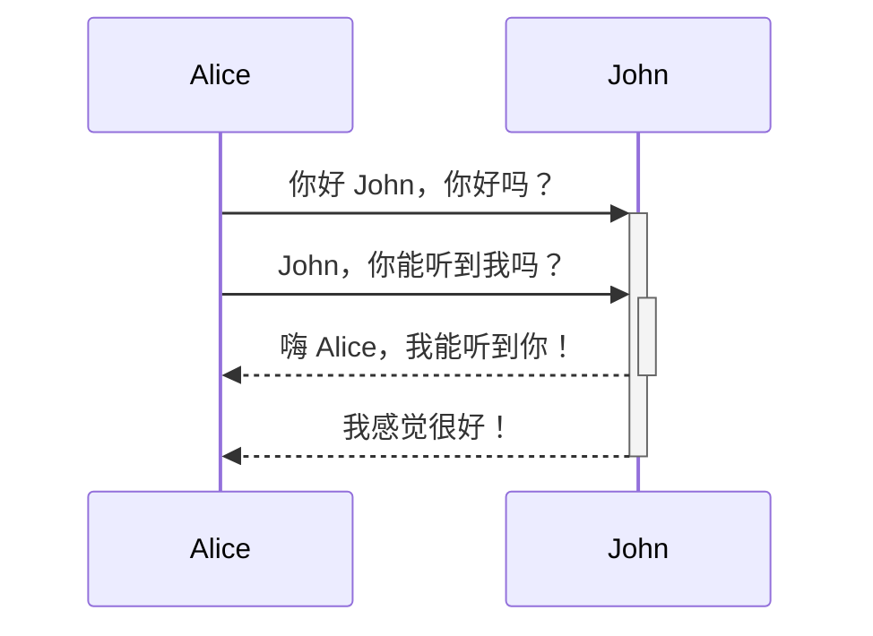
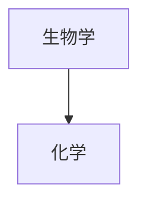

# 此页面复制粘贴了 Markdown 官方格式示例文章，用于快速查看所有功能的渲染效果

# 基本格式化语法

## 段落

要创建段落，请使用空行来分隔。

```
这是一个段落。

这是另一个段落。
```

> [!note]- 多个空格
> 在段落内部的多个空格和段落之间的多个空行在[[编辑与预览笔记|阅读视图]]中会被合并显示为一个空格和一个空行，在 [[发布服务简介|Obsidian 发布服务]]的站点上也是如此。
> 
> ```md
> 多个          相邻          空格
> 
> 
> 
> 和多个段落之间的换行。 
> ```
> 
> > 多个相邻空格
> > 和多个段落之间的换行。
> 
> 如果想要显示多个空格或空行，你可以在笔记中使用 `&nbsp;`（空格）和 `<br>`（换行）。

## 小标题

要创建小标题，在小标题文本前添加至多六个 `#` 符号。`#` 符号的数量决定了小标题的级别。

```md
# 这是标题 1
## 这是标题 2
### 这是标题 3
#### 这是标题 4
##### 这是标题 5
###### 这是标题 6
```

%% 为了避免大纲混乱，以下小标题使用 HTML 编写 %%
<h1>这是标题 1</h1>
<h2>这是标题 2</h2>
<h3>这是标题 3</h3>
<h4>这是标题 4</h4>
<h5>这是标题 5</h5>
<h6>这是标题 6</h6>

## 粗体、斜体、高亮

格式化文本也可以使用[[编辑相关的快捷键]]。

| 样式 | 语法 | 示例 | 输出 |
|-|-|-|-|
| 粗体 | `** **` 或 `__ __` | `**粗体文本**` | **粗体文本** |
| 斜体 | `* *` 或 `_ _`  | `*斜体文本*` | *斜体文本* |
| 删除线 | `~~ ~~` |  `~~删除线文本~~` | ~~删除线文本~~ |
| 高亮 | `== ==` |  `==高亮文本==` | ==高亮文本== |
| 粗体和嵌套斜体 | `** **` 和 `_ _`  | `**粗体和 _嵌套斜体_ 文本**` | **粗体和 _嵌套斜体_ 文本** |
| 粗体和斜体 | `*** ***` 或 `___ ___` |  `***粗体和斜体文本***` | ***粗体和斜体文本*** |

如果需要将语法符号视为普通文本进行展示，需要在语法符号前加反斜杠进行转义。比如：

\*\*这里的加粗不会真正的加粗\*\*

```markdown
\*\*这里的加粗不会真正的加粗\*\*
```

\*这里的倾斜不会真正的倾斜\*

```markdown
\*This line will be italic and show the asterisks\*
```

## 内部链接

Obsidian支持两种风格的[[内部链接]]：

- Wiki 链接风格：`[[运动三定律]]`
- Markdown 链接风格：`[运动三定律](运动三定律.md)`

## 外部链接

如果要链接到外部URL，可以通过在方括号（`[ ]`）中填入描述链接的文本，然后在括号中（`()`）添加URL来创建内联链接。

```md
[Obsidian帮助](https://help.obsidian.md)
```

[Obsidian帮助](https://help.obsidian.md)

你也可以通过[[Obsidian URI|Obsidian URI]]创建指向其他仓库的文件的外部链接。

```md
[笔记](obsidian://open?vault=主仓库&file=笔记.md)
```

### 在链接中转义空格

如果你的URL包含空格，必须用 `%20` 替换它们。

```md
[我的 笔记](obsidian://open?vault=主仓库&file=我的%20笔记.md)
```

你也可以用尖括号（`< >`）包裹URL进行转义。

```md
[我的 笔记]（<obsidian://open?vault=主仓库&file=我的 笔记.md>）
```

## 外部图片

你可以通过在[[#外部链接|外部链接]]前加上 `!` 符号来在笔记中插入外部图片。

```md

```


你可以通过在链接的锚文本中添加 `|640x480` 来更改图片尺寸，其中640是宽度，480是高度。

```md

```

如果只指定了宽度，图片会根据原始长宽比进行缩放。例如：

```md

```

> [!tip]
> 如果要添加来自仓库内部的图片，你也可以[[插入文件|使用嵌入图片语法]]。

## 引用

你可以在文本前加上 `>` 符号来引用文本。

```md
> 人类面临着越来越复杂和紧迫的问题，他们有效应对这些问题的能力对于社会的稳定和持续发展至关重要。

\- 道格·恩格尔巴特，1961
```

> 人类面临着越来越复杂和紧迫的问题，他们有效应对这些问题的能力对于社会的稳定和持续发展至关重要。

\- 道格·恩格尔巴特，1961

> [!tip]
> 你可以通过在引用中的第一行添加 `[!信息]` 来将引用变成[[标注|标注]]。

## 列表

你可以在文本前加上 `-`、`*` 或 `+` 来创建无序列表。

```md
- 第一条
- 第二条
- 第三条
```

- 第一条
- 第二条
- 第三条

要创建有序列表，每行以数字加上 `.` 开头。

```md
1. 第一条
2. 第二条
3. 第三条
```

1. 第一条
2. 第二条
3. 第三条

### 任务列表

要创建任务列表，每个列表项以连字符和空格开头，后跟 `[ ]`。

```md
- [x] 这是已完成的任务。
- [ ] 这是未完成的任务。
```

- [x] 这是已完成的任务。
- [ ] 这是未完成的任务。

你可以在阅读视图中通过点击复选框来切换任务状态。

> [!tip]
> 你可以通过在括号内添加任意字符来将任务标记为已完成状态。
>
> ```md
> - [x] 牛奶
> - [?] 鸡蛋
> - [-] 鸡蛋
> ```
>
> - [x] 牛奶
> - [?] 鸡蛋
> - [-] 鸡蛋

### 嵌套列表

Obsidian中所有类型的列表都支持嵌套。

要创建嵌套列表，请缩进一个或多个列表项：

```md
1. 第一条
   1. 有序嵌套列表项
2. 第二条
   - 无序嵌套列表项
```

1. 第一条
   1. 有序嵌套列表项
2. 第二条
   - 无序嵌套列表项

同样，你可以通过缩进一个或多个列表项来创建嵌套任务列表：

```md
- [ ] 任务项 1
	- [ ] 子任务 1
- [ ] 任务项 2
	- [ ] 子任务 1
```

- [ ] 任务项 1
	- [ ] 子任务 1
- [ ] 任务项 2
	- [ ] 子任务 1

使用 `Tab` 或 `Shift+Tab` 来缩进或取消缩进一个或多个已选择的列表项，以便快速地组织列表。

## 水平线

你可以在单独的一行上使用三个或更多星号 `***`、短横线 `---` 或下划线 `___` 来添加水平线。这些分隔符号里允许有空格。

```md
***
****
* * *
---
----
- - -
___
____
_ _ _
```

***

## 代码

你可以在段落里插入代码，或将其放在代码块中。

### 行内代码

你可以使用一对反引号在句子插入代码。

```md
`反引号`中的文本将被格式化为代码。
```

`反引号`中的文本将被格式化为代码。

如果要在行内代码中使用反引号，请用双反引号将其包围，比如： ``这是一句内部带有`反引号`的代码``。

 ``这是一句内部带有`反引号`的代码``

### 代码块

要创建一个代码块，请用三个反引号括住代码。

~~~
```
cd ~/Desktop
```
~~~

```md
cd ~/Desktop
```

你也可以通过使用 `Tab` 键或4个空格缩进文本来创建代码块。

```md
    cd ~/Desktop
```

你可以在开头的三个反引号后添加语言名称来为代码块添加语法高亮。

~~~md
```js
function fancyAlert(arg) {
  if(arg) {
    $.facebox({div:'#foo'})
  }
}
```
~~~

```js
function fancyAlert(arg) {
  if(arg) {
    $.facebox({div:'#foo'})
  }
}
```

Obsidian 使用 Prism 进行语法高亮。更多信息请参阅[Prism 支持的语言](https://prismjs.com/#supported-languages)。

> [!note]
> [[编辑与预览笔记|源码模式]]和[[编辑与预览笔记|实时预览]]不支持 PrismJS，可能会以不同方式呈现语法高亮。

## 脚注

你可以使用以下语法向笔记中添加脚注[^脚注]：

[^脚注]: 这是一个脚注。

```md
这是一个简单的脚注[^1]。

[^1]: 这是脚注的内容文本。
[^2]: 在每一行的开头添加2个空格，
  可以编写跨越多行的脚注。
[^注释]: 可以使用非数字来命名脚注。但渲染时，脚注仍然会显示为数字。这样可以更容易地识别脚注内容。
```

你也可以在句子中使用行内脚注。请注意插入符号在方括号外，将脚注内容写在方括号内。

```md
你也可以使用内联脚注。^[这是一个内联脚注。]
```

> [!note]
> 行内脚注仅在阅读视图中有效，不适用于实时预览。

## 注释

你可以用 `%%` 包围文本来添加注释。注释只在编辑视图中可见。

```md
这是一个 %%行内%% 注释。

%%
这是一个块注释。

块注释可以跨多行。
%%
```

# 高级格式语法

## 表格

你可以使用竖线（`|`）和短横线（`-`）来创建表格。竖线用于分隔列，短横线用于定义列标题。

```md
| 名字 | 姓氏 |
| ---- | ---- |
| 麦克斯 | 普朗克 |
| 玛丽 | 居里 |
```

| 名字 | 姓氏 |
| ---- | ---- |
| 麦克斯 | 普朗克 |
| 玛丽 | 居里 |

表格两侧的竖线是可选的。

单元格不需要与列完全对齐。每个标题行至少要有两个短横线。

```md
名字 | 姓氏
-- | --
麦克斯 | 普朗克
玛丽 | 居里
```

### 格式化表格内容

你可以使用[[基本格式语法]]来为表格内的内容添加基本样式。

第一列 | 第二列
-- | --
[[内部链接]] | 链接到**vault**内的文件。
[[插入文件]] | 直接嵌入库内文件

> [!note] 表格中的竖线
> 如果你想在表格中使用[[别名]]，或者在表格中[[基本格式语法|调整图片大小]]，你需要在竖线前加上 `\` 以防止符号错误识别。
>
> ```md
> 第一列 | 第二列
> -- | --
> [[Basic formatting syntax\|Markdown 语法]] | ![[og-image.png\|200]]
> ```
>
> 第一列 | 第二列
> -- | --
> [[基本格式语法\|Markdown 语法]] | ![[og-image.png\|200]]

通过在标题行中添加冒号（`:`），你可以将文本左对齐、居中或右对齐。

```md
左对齐文本 | 居中文本 | 右对齐文本
:-- | :--: | --:
内容 | 内容 | 内容
```

左对齐文本 | 居中文本 | 右对齐文本
:-- | :--: | --:
内容 | 内容 | 内容

## 图表

你可以使用 [Mermaid](https://mermaid-js.github.io/) 语法在笔记中添加图表和流程图。Mermaid 支持多种图表，如[流程图](https://mermaid.js.org/syntax/flowchart.html)、[时序图](https://mermaid.js.org/syntax/sequenceDiagram.html)和[时间线](https://mermaid.js.org/syntax/timeline.html)等。

> [!tip]
> 你也可以尝试使用 Mermaid 的 [在线编辑器](https://mermaid-js.github.io/mermaid-live-editor) 来帮助你在笔记中添加图表。

要添加 Mermaid 图表，创建一个 `mermaid` [[基本格式语法|代码块]]。

````md

````


````md

````


### 在图表中添加链接

你可以通过将节点声明为 `internal-link` [类型](https://mermaid.js.org/syntax/flowchart.html#classes) 来在图表中创建[[内部链接]]。

````md

````


> [!note]
> 图表中的内部链接不会显示在 [[关系图谱]]中。

如果你的图表中有很多节点，你可以使用以下代码片段。

````md

````

这样，每个字母节点都会成为一个内部链接，[节点文本](https://mermaid.js.org/syntax/flowchart.html#a-node-with-text)将作为链接文本。

> [!note]
> 如果你的笔记名称中包含特殊字符，你需要将笔记名称放在双引号中。
>
> ```
> class "⨳ 特殊字符" internal-link
> ```
>
> 或者 `A["⨳ 特殊字符"]`。

想了解更多有关创建图表的信息，请参阅[Mermaid 官方文档](https://mermaid.js.org/intro/)。

## 数学公式

你可以使用 [MathJax](http://docs.mathjax.org/en/latest/basic/mathjax.html) 和 LaTeX 符号在笔记中添加数学公式。

要在笔记中添加 MathJax 公式，请用双美元符号（`$$`）将其括起来。

```md
$$
\begin{vmatrix}a & b\\
c & d
\end{vmatrix}=ad-bc
$$
```

$$
\begin{vmatrix}a & b\\
c & d
\end{vmatrix}=ad-bc
$$

你也可以用 `$` 符号包裹数学公式来实现行内数学公式。

```md
这是一个行内数学表达式 $e^{2i\pi} = 1$。
```

这是一个行内数学表达式 $e^{2i\pi} = 1$。

想了解更多有关语法的信息，请参阅[MathJax 基础教程](https://math.meta.stackexchange.com/questions/5020/mathjax-basic-tutorial-and-quick-reference)。

要查看支持的 MathJax 包列表，请参阅[TeX/LaTeX 扩展列表](http://docs.mathjax.org/en/latest/input/tex/extensions/index.html)。